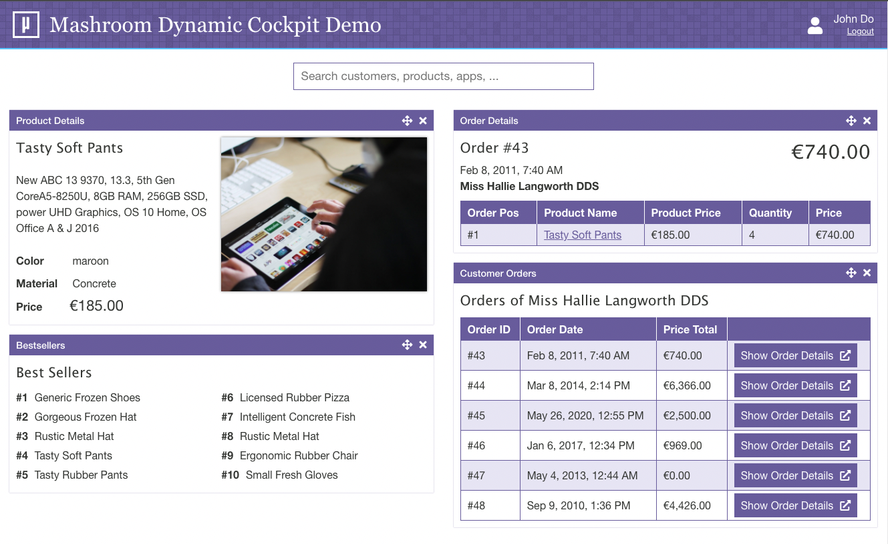

# Mashroom Dynamic Cockpit Demo

This demo shows how to create a dynamic cockpit based on a search backend and a bunch of SPAs with [Mashroom Portal](https://www.mashroom-server.com).



The demo consists of a Portal page with a search that fetches results from a backend and at the same times searches for Apps,
which are able to show some details for the search hits. It also searches Apps by name and displays them inline -
within the backend search results - if they don't need any input (such as a customerId).

The possible Apps are determined dynamically based on meta info in the plugin definition:

```json
{
    "plugins": [
        {
            "name": "Mashroom Dynamic Cockpit Demo Customer Details App",
            // ...
            "defaultConfig": {
                "metaInfo": {
                    "demoCockpit": {
                        "viewType": "Details",
                        "entity": "Customer"
                    }
                },
                // ...
            }
        }
    ]
}
```

...which means: This App can display details for the search hit entity "Customer".

So, this concept allows it to extend the cockpit dynamically by just registering new Apps
(which can also happen dynamically and even without a Portal restart in case of *Remote Apps*).

Notable other features:

 * Apps can open other Apps via message bus to show some further details (e.g. Customer -> Customer Orders)
 * Apps in the content area can be moved via Drag and Drop
 * Apps can even appear in the search result, if the search terms match the App name, and the App does not require any config
   (enter "bestseller" into the search field to try it out)
 * The Cockpit also integrates the Demo Remote App from http://demo-remote-app.mashroom-server.com - so if you enter "chuck"
   in the search you will see a random Chuck Norris joke ;-)

## Modules

 * cockpit-management-app: The central App that provides the search and manages adding and removing Apps
 * mock-backend: A demo search backend with some mock data
 * startup-job: A startup plugin that configures the cockpit page if it doesn't exist yet
 * theme-extension: A page enhancement plugin with some extra style for the cockpit page

All other modules are demo Apps to display data.

## Start the demo

Requirements:
  * Node.js >= 14


    npm run setup
    cd test/test-server
    npm start


The cockpit will be available at http://localhost:5050/portal/web/cockpit - user is: john/john

Notes:
 * It might take some time until the "Cockpit Demo" page appears, since the plugins need to be built first
 * If something goes wrong, check the Admin UI: http://localhost:5050/mashroom/admin

### Using Docker

    docker build -t mashroom-demo-dynamic-cockpit .
    docker run -e NODE_ENV=production -p 5050:5050 mashroom-demo-dynamic-cockpit

## Article

Check out this blog entry for more details: TODO
