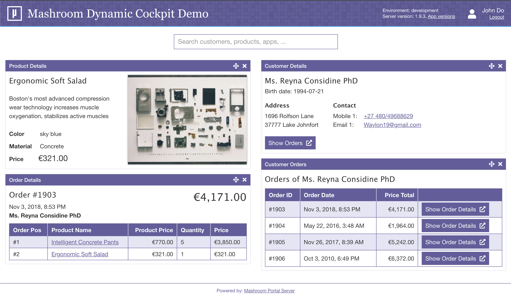

# Mashroom Dynamic Cockpit Demo

This demo shows how to create a dynamic cockpit based on a search backend and a bunch of SPAs with [Mashroom Portal](https://www.mashroom-server.com).



It consists of a Portal page with a search that fetches data from a backend and shows it together with Apps, which are able to show details
for every hit. The possible Apps are determined dynamically based on meta info in the plugin definition:

```json
    "metaInfo": {
        "demoCockpit": {
            "viewType": "Details",
            "entity": "Customer"
        }
    },
```

which means: This App can display details for the search hit entity "Customer".

Notable other features:

 * Apps can open other Apps to show some further details (e.g. Customer -> Customer Orders)
 * Apps in then content area can be moved via Drag and Drop
 * Apps can even appear in the search result, if the search terms match the App name, and it does not require any config
   (enter "bestseller" into the search to try it out)

## Modules

 * cockpit-management-app: The central App that provides the search and manages adding and removing Apps
 * mock-backend: A demo search backend with some mock data
 * startup-job: A startup plugin that configures the cockpit page if it doesn't exist yet
 * theme-extension: A page enhancement plugin with some extra style for the cockpit page

All other modules are demo Apps to display some data.

## Start the demo

    npm run setup
    cd test/test-server
    npm start

The cockpit will be available at http://localhost:5050/portal/web/cockpit - user is: john/john
